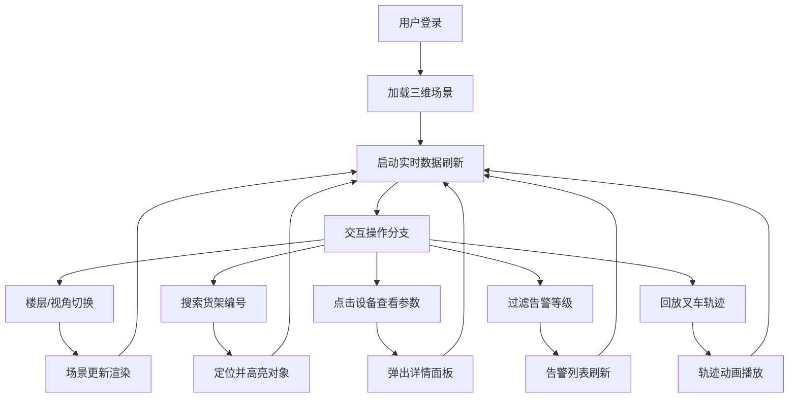

## 1. 产品概述

物流仓库数字孪生监控系统是一款基于三维可视化技术的智能仓储管理平台，通过数字孪生技术实现仓库物理实体的数字化映射，帮助管理人员实时监控仓库运营状态、快速定位异常问题、优化资源配置。

- **核心目标**：提升仓库运营可视化水平，降低异常响应时间，优化库存与设备管理效率
- **目标用户**：仓库管理人员、运维工程师、物流运营总监
- **市场价值**：填补传统 WMS 系统在三维可视化与实时交互方面的空白

## 2. 核心功能

### 2.1 用户角色

| 角色 | 登录方式 | 核心权限 |
|------|----------|----------|
| 仓库管理员 | 账号密码登录 | 完整监控权限、告警处理、参数配置 |
| 运维工程师 | 账号密码登录 | 设备监控、故障处理、轨迹回放 |
| 访客用户 | 只读访问 | 数据查看、视角切换 |

### 2.2 功能模块

1. **三维场景模块**：库区建筑、货架系统、装卸口、叉车、传感器点位的 3D 建模与渲染
2. **实时监控模块**：库存容量、温湿度、设备状态、通道拥堵的实时可视化
3. **交互控制模块**：楼层切换、视角切换、货架搜索、设备参数查看
4. **告警管理模块**：多等级告警展示、告警过滤、异常标识与动画
5. **数据分析模块**：库存利用率、异常趋势、设备状态统计图表
6. **轨迹回放模块**：叉车移动路线记录、历史轨迹回放、速度控制

### 2.3 页面详情

| 页面名称 | 模块名称 | 功能描述 |
|---------|---------|----------|
| 主监控页面 | 三维场景区 | 全屏 3D 仓库场景，支持鼠标旋转、缩放、平移 |
| 主监控页面 | 顶部工具栏 | 楼层切换、视角预设、搜索框、告警过滤、回放控制 |
| 主监控页面 | 左侧数据面板 | 库存容量统计、温湿度实时数据、设备在线状态 |
| 主监控页面 | 右侧告警面板 | 告警列表、等级筛选、时间筛选、处理状态 |
| 主监控页面 | 底部图表区 | 库存利用率趋势图、异常统计柱状图、通道拥堵热力图 |
| 设备详情弹窗 | 参数面板 | 设备编号、实时参数、历史数据、关联告警 |

## 3. 核心流程

用户进入系统后，首先加载默认楼层的三维场景，实时数据自动刷新。用户可以通过工具栏切换楼层、调整视角，点击三维对象查看详细信息，通过搜索功能快速定位货架，通过告警面板处理异常，通过回放功能查看叉车历史轨迹。

## 4. 用户界面设计

### 4.1 设计风格
- **主色调**：深空蓝 (#0A1628) 作为背景，科技蓝 (#1890FF) 作为主色，警示红 (#FF4D4F)、警告黄 (#FAAD14)、成功绿 (#52C41A) 作为状态色
- **视觉风格**：工业科技风、深色主题、赛博朋克元素、发光边框、全息投影效果
- **字体**：使用 JetBrains Mono 作为数字显示字体，PingFang SC 作为中文界面字体
- **布局**：全屏沉浸式 3D 场景 + 悬浮式半透明数据面板 + 顶部工具栏

### 4.2 页面设计概述

| 页面名称 | 模块名称 | UI 元素 |
|---------|---------|---------|
| 主监控页面 | 三维场景区 | 暗色系仓库模型、发光设备标识、流动的路径线、告警闪烁动画、鼠标悬停高亮 |
| 主监控页面 | 顶部工具栏 | 玻璃态背景、发光按钮、下拉选择器、搜索输入框、时间轴控件 |
| 主监控页面 | 数据面板 | 毛玻璃效果、渐变边框、数字跳动动画、进度条、状态指示灯 |
| 主监控页面 | 告警面板 | 分级颜色标识、滚动动画、处理按钮、时间戳 |
| 主监控页面 | 图表区 | 渐变填充曲线、动态数据更新、高亮数据点、悬浮提示 |

### 4.3 响应式设计
- 桌面端优先设计，支持 1920×1080 及以上分辨率
- 面板支持拖拽调整大小和位置
- 小屏幕下自动折叠侧边面板，提供全屏场景模式

### 4.4 3D 场景设计
- **环境**：深色工业风格，使用环境光 + 方向光 + 点光源组合，适当的辉光后处理效果
- **灯光**：顶部主光源模拟厂房照明，设备自带发光材质，告警时红色闪烁光源
- **相机**：默认透视相机，支持第一人称、第三人称、顶视图、正交视图切换
- **动画**：叉车移动动画、传送带滚动效果、告警闪烁动画、数据变化时的材质过渡
- **性能**：使用 InstancedMesh 渲染重复货架，LOD 技术优化远距离渲染，帧率目标 60 FPS
