## 1. 架构设计

```mermaid
graph TD
    subgraph "前端应用层"
        A["Vue 3 组件层"] --> A1["主监控页面 App.vue"]
        A --> A2["工具栏组件 Toolbar.vue"]
        A --> A3["数据面板 DataPanel.vue"]
        A --> A4["告警面板 AlarmPanel.vue"]
        A --> A5["图表组件 Charts.vue"]
        A --> A6["设备详情弹窗 DeviceModal.vue"]
    end
    
    subgraph "3D 渲染层"
        B["Three.js 场景层"] --> B1["场景管理 SceneManager.ts"]
        B --> B2["模型构建器 ModelBuilder.ts"]
        B --> B3["渲染循环 RenderLoop.ts"]
        B --> B4["效果合成 EffectComposer.ts"]
    end
    
    subgraph "交互控制层"
        C["交互模块"] --> C1["射线拾取 Raycaster.ts"]
        C --> C2["标签跟随 LabelManager.ts"]
        C --> C3["相机控制 CameraController.ts"]
        C --> C4["动画控制 AnimationController.ts"]
    end
    
    subgraph "数据服务层"
        D["数据模块"] --> D1["模拟数据生成 MockData.ts"]
        D --> D2["数据刷新服务 DataService.ts"]
        D --> D3["状态管理 Store.ts"]
        D --> D4["告警管理器 AlarmManager.ts"]
    end
    
    subgraph "工具层"
        E["工具函数"] --> E1["类型定义 types.ts"]
        E --> E2["工具函数 utils.ts"]
        E --> E3["配置文件 config.ts"]
    end
    
    A --> B
    A --> C
    A --> D
    B --> E
    C --> E
    D --> E
```



## 2. 技术描述

- **前端框架**：Vue 3.4 + TypeScript 5.4 + Vite 5.2
- **3D 引擎**：Three.js 0.160 + @types/three
- **图表库**：ECharts 5.4
- **状态管理**：Pinia 2.1
- **样式方案**：SCSS + CSS 变量
- **UI 组件**：Element Plus 2.5 (按需引入)
- **后端服务**：使用模拟数据，预留 WebSocket 接口
- **构建工具**：Vite 5，配置按需打包、代码分割、Tree Shaking

## 3. 目录结构与模块定义

| 目录 | 模块文件 | 职责描述 |
|------|---------|---------|
| `/src/scene` | SceneManager.ts | Three.js 场景、相机、渲染器的初始化与管理 |
| `/src/scene` | RenderLoop.ts | 渲染循环控制、帧率统计、性能监控 |
| `/src/scene` | EffectComposer.ts | 后处理效果（辉光、抗锯齿） |
| `/src/models` | Warehouse.ts | 库区建筑、地面、墙体模型 |
| `/src/models` | Shelf.ts | 货架模型与库存可视化 |
| `/src/models` | Forklift.ts | 叉车模型与移动动画 |
| `/src/models` | LoadingDock.ts | 装卸口模型 |
| `/src/models` | Sensor.ts | 传感器点位与状态标识 |
| `/src/interactions` | Raycaster.ts | 射线拾取、点击/悬停检测 |
| `/src/interactions` | LabelManager.ts | DOM 标签跟随 3D 对象 |
| `/src/interactions` | CameraController.ts | 视角切换、预设机位、轨道控制 |
| `/src/interactions` | SearchLocator.ts | 货架搜索定位与高亮 |
| `/src/interactions` | PlaybackController.ts | 叉车轨迹回放控制 |
| `/src/data` | MockData.ts | 模拟数据生成器 |
| `/src/data` | DataService.ts | 实时数据刷新服务 |
| `/src/data` | AlarmManager.ts | 告警生成、过滤、处理 |
| `/src/data` | TrackRecorder.ts | 叉车轨迹记录 |
| `/src/data` | warehouseStore.ts | Pinia 状态管理 |
| `/src/panels` | Toolbar.vue | 顶部工具栏 |
| `/src/panels` | DataPanel.vue | 左侧数据面板 |
| `/src/panels` | AlarmPanel.vue | 右侧告警面板 |
| `/src/panels` | DeviceModal.vue | 设备详情弹窗 |
| `/src/charts` | UtilizationChart.vue | 库存利用率趋势图 |
| `/src/charts` | AlarmTrendChart.vue | 异常趋势图 |
| `/src/charts` | ChannelHeatmap.vue | 通道拥堵热力图 |
| `/src/types` | index.ts | TypeScript 类型定义 |
| `/src/config` | index.ts | 场景配置、色彩配置、告警配置 |
| `/src/utils` | index.ts | 通用工具函数 |

## 4. 路由定义

| 路由 | 页面组件 | 说明 |
|------|---------|------|
| `/` | `views/Dashboard.vue` | 主监控大屏，包含 3D 场景与所有面板 |
| `/login` | `views/Login.vue` | 登录页面（可选） |

## 5. 数据模型定义

### 5.1 核心数据类型

```typescript
// 货架数据
interface ShelfData {
  id: string;
  code: string;
  floor: number;
  position: { x: number; z: number };
  levels: number;
  slotsPerLevel: number;
  usedSlots: number;
  capacity: number;
  utilization: number;
  temperature: number;
  humidity: number;
}

// 叉车数据
interface ForkliftData {
  id: string;
  code: string;
  status: 'idle' | 'working' | 'offline' | 'error';
  position: { x: number; y: number; z: number };
  rotation: number;
  battery: number;
  speed: number;
  currentTask: string | null;
  driver: string | null;
}

// 传感器数据
interface SensorData {
  id: string;
  code: string;
  type: 'temperature' | 'humidity' | 'smoke' | 'door' | 'infrared';
  position: { x: number; y: number; z: number };
  value: number;
  status: 'normal' | 'warning' | 'alarm' | 'offline';
  lastUpdate: number;
}

// 告警数据
interface AlarmData {
  id: string;
  level: 'critical' | 'warning' | 'info';
  type: 'temperature' | 'humidity' | 'offline' | 'congestion' | 'capacity';
  targetId: string;
  targetType: string;
  message: string;
  timestamp: number;
  status: 'unhandled' | 'processing' | 'resolved';
}

// 轨迹点
interface TrackPoint {
  timestamp: number;
  position: { x: number; y: number; z: number };
  rotation: number;
  speed: number;
}
```

## 6. 关键技术实现方案

### 6.1 3D 渲染性能优化
- **InstancedMesh**：批量渲染货架、传感器等重复对象，减少 Draw Call
- **LOD (Level of Detail)**：根据距离切换模型细节等级
- **视锥体剔除**：只渲染相机可见范围内的对象
- **材质共享**：相同外观的对象共享材质实例
- **几何合并**：静态对象合并为单一 BufferGeometry

### 6.2 射线拾取优化
- 使用八叉树空间划分加速射线检测
- 分层拾取：先检测大对象，再细化子对象
- 鼠标移动防抖处理，避免频繁射线检测

### 6.3 标签跟随实现
- CSS3DRenderer 渲染 HTML 标签
- 每一帧更新标签的屏幕坐标
- 距离相机过远时自动隐藏标签
- 标签重叠时动态调整位置

### 6.4 场景销毁与资源释放
- 组件卸载时调用 dispose() 释放几何体、材质、纹理
- 移除事件监听器、取消动画帧请求
- 清空数据缓存，避免内存泄漏
- WebGL 上下文丢失处理

### 6.5 响应式布局
- 使用 ResizeObserver 监听容器尺寸变化
- 动态调整相机宽高比与渲染器尺寸
- 面板使用 Flex 布局，支持拖拽调整
- 断点式响应：>1920px 展开全部，<1280px 折叠侧边栏
