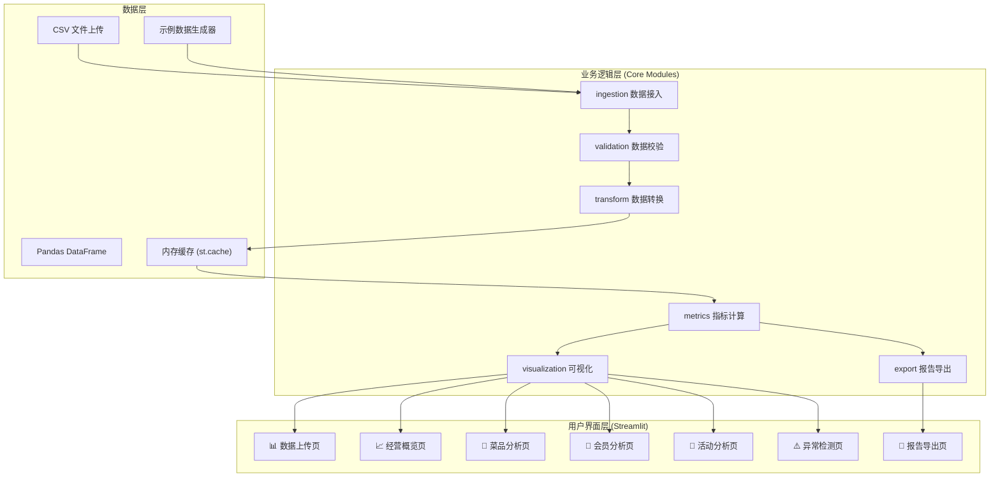
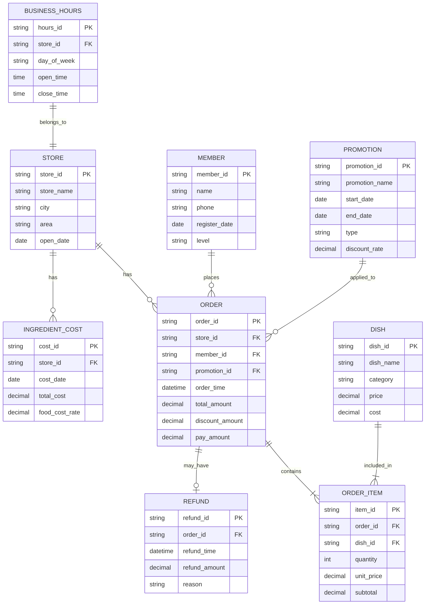

## 1. 架构设计



## 2. 技术栈说明

- **前端框架**: Streamlit 1.30+ （多页面应用架构）
- **数据处理**: Pandas 2.0+, NumPy 1.24+
- **可视化**: Plotly 5.18+, Plotly Express
- **统计分析**: SciPy 1.10+, Scikit-learn 1.3+
- **报告导出**: OpenPyXL 3.1+, XlsxWriter 3.1+, Jinja2 3.1+
- **其他工具**: Python-dotenv 1.0+, Click 8.1+
- **Python 版本**: 3.10+

## 3. 页面路由（Streamlit 多页面）

| 路由文件 | 页面标题 | 功能说明 |
|----------|----------|----------|
| `1_📊_数据上传与校验.py` | 数据上传与校验 | 多文件上传、数据质量检查 |
| `2_📈_经营概览.py` | 经营概览 | 核心指标、趋势分析 |
| `3_🍜_菜品分析.py` | 菜品分析 | 销售排行、组合分析 |
| `4_👥_会员与复购.py` | 会员与复购 | RFM 分析、客单价 |
| `5_🎁_活动与退款.py` | 活动与退款 | 活动效果、退款分析 |
| `6_⚠️_异常检测.py` | 异常检测 | 异常门店、成本监控 |
| `7_📄_报告导出.py` | 报告导出 | Excel/HTML 报告 |

## 4. 核心模块 API 定义

### 4.1 ingestion 模块

```python
def load_csv_files(uploaded_files: List[st.runtime.uploaded_file_manager.UploadedFile]) -> Dict[str, pd.DataFrame]:
    """加载多份 CSV 文件，返回命名 DataFrame 字典"""

def load_sample_data() -> Dict[str, pd.DataFrame]:
    """加载内置示例数据（1000 条）"""
```

### 4.2 validation 模块

```python
def validate_schema(df: pd.DataFrame, expected_schema: Dict[str, str]) -> ValidationResult:
    """验证 DataFrame 字段名和类型"""

def check_missing_values(df: pd.DataFrame) -> MissingDataReport:
    """检查缺失数据并生成报告"""

def validate_all_datasets(data_dict: Dict[str, pd.DataFrame]) -> ValidationReport:
    """验证所有数据集并生成汇总报告"""
```

### 4.3 transform 模块

```python
def clean_data(data_dict: Dict[str, pd.DataFrame]) -> Dict[str, pd.DataFrame]:
    """数据清洗：类型转换、缺失值处理、异常值过滤"""

def merge_orders_with_details(data_dict: Dict[str, pd.DataFrame]) -> pd.DataFrame:
    """关联订单主表与明细表"""

def filter_by_date_and_store(df: pd.DataFrame, date_range: Tuple[datetime, datetime], 
                            store_ids: List[str]) -> pd.DataFrame:
    """按日期范围和门店筛选数据"""
```

### 4.4 metrics 模块

```python
def calculate_kpi_metrics(df: pd.DataFrame) -> Dict[str, float]:
    """计算核心 KPI：营业额、毛利、客单价、订单数等"""

def calculate_dish_metrics(df: pd.DataFrame) -> pd.DataFrame:
    """计算菜品维度指标：销量、销售额、毛利占比"""

def calculate_rfm(df: pd.DataFrame) -> pd.DataFrame:
    """计算会员 RFM 指标并分层"""

def detect_anomalous_stores(df: pd.DataFrame, method: str = "iqr") -> pd.DataFrame:
    """识别异常门店（IQR 或 Z-score 方法）"""
```

### 4.5 visualization 模块

```python
def plot_revenue_trend(df: pd.DataFrame, freq: str = "D") -> go.Figure:
    """绘制营业额趋势图"""

def plot_store_comparison(df: pd.DataFrame, metric: str) -> go.Figure:
    """绘制门店对比图"""

def plot_dish_ranking(df: pd.DataFrame, top_n: int = 20) -> go.Figure:
    """绘制菜品排行图"""

def plot_rfm_scatter(df: pd.DataFrame) -> go.Figure:
    """绘制 RFM 散点图"""
```

### 4.6 export 模块

```python
def generate_excel_report(analysis_results: Dict[str, Any], output_path: str) -> str:
    """生成 Excel 格式分析报告"""

def generate_html_report(analysis_results: Dict[str, Any], template_path: str) -> str:
    """生成 HTML 格式分析报告"""
```

## 5. 数据模型

### 5.1 数据实体关系图



### 5.2 示例数据规格

共生成 8 张数据表，约 1000 条订单数据：

| 表名 | 记录数 | 说明 |
|------|--------|------|
| stores | 10 | 10 家连锁门店 |
| dishes | 50 | 50 道菜品 |
| members | 200 | 200 位会员 |
| promotions | 15 | 15 个优惠活动 |
| orders | 1000 | 1000 条订单主记录 |
| order_items | 2500 | 2500 条订单明细 |
| refunds | 80 | 80 条退款记录 |
| business_hours | 70 | 7 天 × 10 店营业时间 |
| ingredient_costs | 300 | 30 天 × 10 店原料成本 |

## 6. 目录结构

```
r36/
├── .trae/documents/          # 项目文档
├── app.py                    # Streamlit 入口
├── requirements.txt          # 依赖清单
├── .gitignore               # Git 忽略
├── README.md                # 说明文档
├── sample_data/             # 示例数据目录
│   ├── generate_data.py     # 数据生成脚本
│   └── *.csv                # 生成的示例 CSV
├── config/                  # 配置目录
│   └── schemas.py           # 数据schema定义
├── core/                    # 核心模块
│   ├── __init__.py
│   ├── ingestion.py         # 数据接入
│   ├── validation.py        # 数据校验
│   ├── transform.py         # 数据转换
│   ├── metrics.py           # 指标计算
│   ├── visualization.py     # 可视化
│   └── export.py            # 报告导出
├── pages/                   # Streamlit 多页面
│   ├── 1_📊_数据上传与校验.py
│   ├── 2_📈_经营概览.py
│   ├── 3_🍜_菜品分析.py
│   ├── 4_👥_会员与复购.py
│   ├── 5_🎁_活动与退款.py
│   ├── 6_⚠️_异常检测.py
│   └── 7_📄_报告导出.py
├── templates/               # 报告模板
│   └── report_template.html
├── exports/                 # 导出报告目录
├── uploads/                 # 上传数据目录
└── logs/                    # 运行日志目录
```
