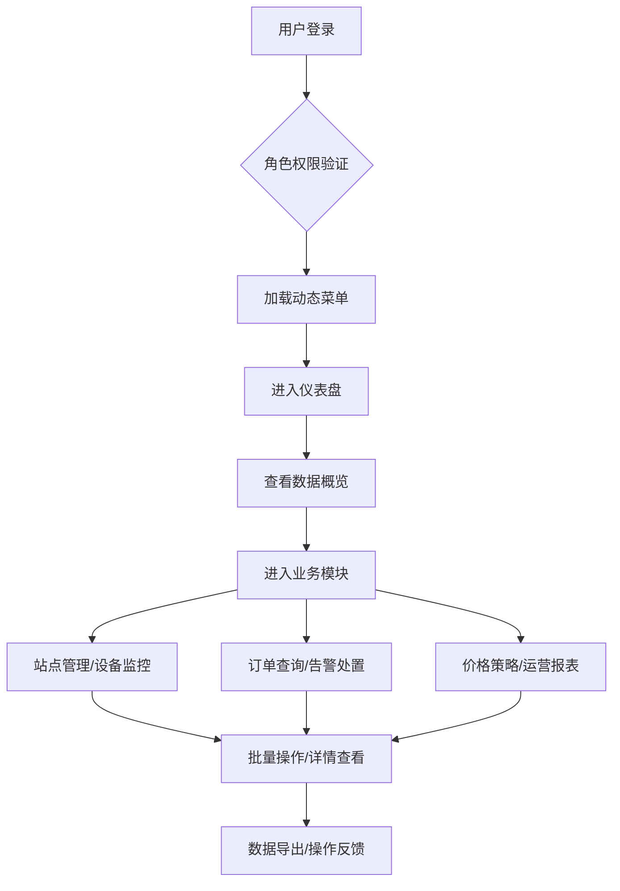

## 1. 产品概述
城市充电站运营管理后台系统，为充电站运营方提供全方位的设备监控、订单管理、故障告警和数据分析能力。
- 目标用户：充电站运营管理人员、运维人员、财务人员
- 产品价值：提升充电站运营效率，降低运维成本，优化资源配置

## 2. 核心功能

### 2.1 用户角色
| 角色 | 登录方式 | 核心权限 |
|------|----------|----------|
| 超级管理员 | 账号密码登录 | 全部功能权限、用户管理、角色配置 |
| 运营管理员 | 账号密码登录 | 站点管理、订单查询、价格策略、报表查看 |
| 运维人员 | 账号密码登录 | 设备监控、告警处置、故障处理 |
| 财务人员 | 账号密码登录 | 收入统计、运营报表、数据导出 |

### 2.2 功能模块
1. **登录页面**: 账号密码登录、角色选择、主题切换
2. **仪表盘**: 站点在线率、充电桩状态、充电订单趋势、故障预警、收入变化、区域热度分布
3. **站点管理**: 站点列表、新增/编辑站点、站点详情、批量操作
4. **设备详情**: 充电桩列表、状态监控、远程控制、设备参数
5. **告警处置**: 告警列表、告警详情、告警处理、告警统计
6. **订单查询**: 充电订单、多条件筛选、订单详情、批量导出
7. **价格策略**: 电价配置、时段设置、优惠策略
8. **运营报表**: 收入报表、设备利用率、充电量统计、报表导出

### 2.3 页面详情
| 页面名称 | 模块名称 | 功能描述 |
|----------|----------|----------|
| 登录页 | 登录表单 | 账号密码验证、验证码、记住密码、暗色主题切换 |
| 仪表盘 | 统计卡片 | 站点总数、在线率、今日充电量、今日收入、告警数量 |
| 仪表盘 | 图表区域 | 订单趋势图、收入变化图、充电桩状态饼图、区域热度地图 |
| 站点管理 | 站点列表 | 分页、多条件筛选、批量删除/启用/禁用、新增编辑 |
| 站点管理 | 详情抽屉 | 站点基本信息、设备列表、充电统计、操作日志 |
| 设备详情 | 设备列表 | 设备状态筛选、设备搜索、远程重启、参数配置 |
| 告警处置 | 告警列表 | 告警级别筛选、批量处理、告警详情、处理记录 |
| 订单查询 | 订单列表 | 多条件筛选、订单详情、导出Excel、批量操作 |
| 价格策略 | 电价配置 | 分时电价设置、阶梯电价、优惠管理 |
| 运营报表 | 报表展示 | 多维度统计、图表联动、报表导出、自定义时间范围 |

## 3. 核心流程
用户登录系统后，根据角色权限展示对应菜单。运营管理员可查看仪表盘概览，进入各功能模块进行业务操作；运维人员专注于设备监控和告警处理。所有操作支持批量处理和数据导出。

## 4. 用户界面设计
### 4.1 设计风格
- 主色调：科技蓝 (#409EFF)，象征新能源和科技感
- 辅助色：成功绿 (#67C23A)、警告橙 (#E6A23C)、危险红 (#F56C6C)、信息灰 (#909399)
- 按钮风格：圆角 4px，悬停阴影，过渡动画
- 字体：Inter 无衬线字体，层级清晰
- 布局：左侧导航菜单 + 顶部工具栏 + 主内容区域，卡片式布局
- 图标：Element Plus 图标库，统一线框风格

### 4.2 页面设计概述
| 页面名称 | 模块名称 | UI 元素 |
|----------|----------|---------|
| 登录页 | 登录卡片 | 居中布局、渐变背景、毛玻璃效果、平滑动画 |
| 仪表盘 | 统计卡片 | 渐变背景、数字动画、图标点缀、悬停上浮 |
| 仪表盘 | 图表区域 | ECharts 可视化、响应式布局、数据联动 |
| 列表页 | 数据表格 | 斑马纹、行悬停高亮、固定表头、虚拟滚动 |
| 列表页 | 筛选区域 | 表单项排列、折叠展开、重置查询 |
| 详情页 | 抽屉组件 | 滑入动画、分步表单、操作按钮组 |

### 4.3 响应式
- 桌面端优先设计，支持 1280px 以上分辨率
- 侧边栏可折叠，适配不同屏幕宽度
- 表格支持横向滚动，确保小屏数据完整展示

### 4.4 动效设计
- 页面加载：骨架屏占位，内容渐显
- 数据变化：数字滚动动画，图表重绘过渡
- 交互反馈：按钮悬停、点击波纹、消息提示
- 抽屉/弹窗：平滑滑入，背景模糊
