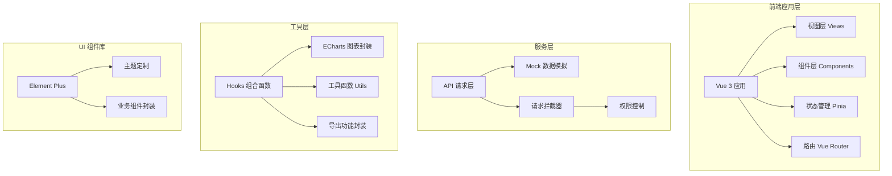
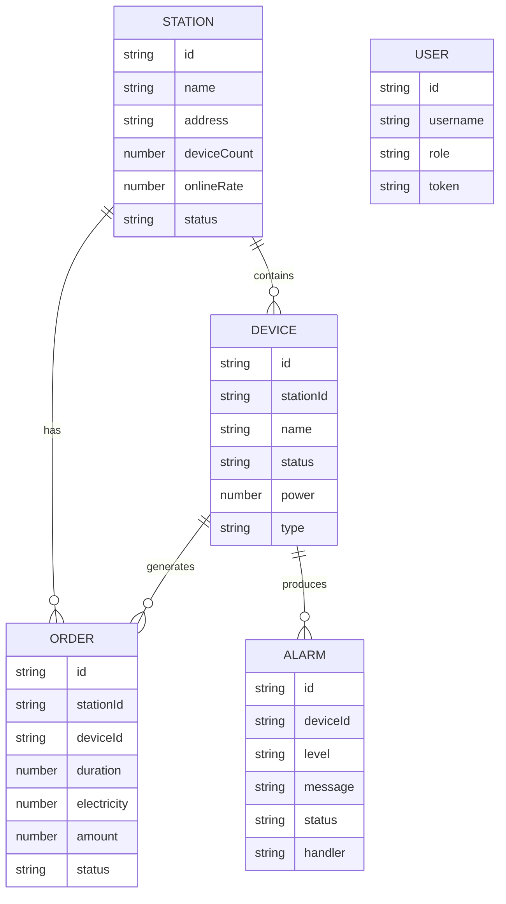

## 1. 架构设计



## 2. 技术栈说明
- **前端框架**: Vue 3.4+ + TypeScript 5.0+
- **构建工具**: Vite 5.0+
- **状态管理**: Pinia 2.1+
- **路由管理**: Vue Router 4.2+
- **UI 组件库**: Element Plus 2.4+
- **图表库**: ECharts 5.4+
- **数据模拟**: Mock.js + 自定义 Mock 服务
- **代码规范**: ESLint + Prettier
- **样式方案**: SCSS + CSS Variables

## 3. 目录结构
```
src/
├── api/              # API 接口层
│   ├── request.ts    # 请求封装
│   ├── station.ts    # 站点相关接口
│   ├── device.ts     # 设备相关接口
│   ├── order.ts      # 订单相关接口
│   ├── alarm.ts      # 告警相关接口
│   ├── price.ts      # 价格相关接口
│   ├── report.ts     # 报表相关接口
│   └── user.ts       # 用户相关接口
├── views/            # 页面视图
│   ├── Login/        # 登录页
│   ├── Dashboard/    # 仪表盘
│   ├── Station/      # 站点管理
│   ├── Device/       # 设备详情
│   ├── Alarm/        # 告警处置
│   ├── Order/        # 订单查询
│   ├── Price/        # 价格策略
│   └── Report/       # 运营报表
├── components/       # 公共组件
│   ├── Layout/       # 布局组件
│   ├── Charts/       # 图表组件
│   ├── Table/        # 表格组件
│   ├── Form/         # 表单组件
│   └── Common/       # 通用组件
├── stores/           # Pinia 状态管理
│   ├── user.ts       # 用户状态
│   ├── app.ts        # 应用状态
│   └── permission.ts # 权限状态
├── router/           # 路由配置
│   └── index.ts
├── mock/             # Mock 数据
│   ├── index.ts      # Mock 服务入口
│   ├── station.ts
│   ├── device.ts
│   ├── order.ts
│   ├── alarm.ts
│   └── user.ts
├── hooks/            # 组合函数
│   ├── useChart.ts   # 图表 Hook
│   ├── useTable.ts   # 表格 Hook
│   ├── useExport.ts  # 导出 Hook
│   └── usePermission.ts # 权限 Hook
├── utils/            # 工具函数
│   ├── request.ts
│   ├── auth.ts
│   └── export.ts
├── styles/           # 全局样式
│   ├── index.scss
│   ├── variables.scss
│   └── dark.scss
├── types/            # 类型定义
│   └── index.ts
├── App.vue
└── main.ts
```

## 4. 路由定义
| 路由路径 | 页面名称 | 权限要求 |
|----------|----------|----------|
| /login | 登录页 | 公开 |
| /dashboard | 仪表盘 | 登录用户 |
| /station | 站点管理 | 运营管理员/超级管理员 |
| /device | 设备详情 | 运维人员/超级管理员 |
| /alarm | 告警处置 | 运维人员/超级管理员 |
| /order | 订单查询 | 运营管理员/财务人员/超级管理员 |
| /price | 价格策略 | 运营管理员/超级管理员 |
| /report | 运营报表 | 财务人员/超级管理员 |

## 5. 核心数据模型

### 5.1 数据模型定义


### 5.2 设备状态枚举
- `idle`: 空闲 - 设备正常，可使用
- `charging`: 充电中 - 正在进行充电服务
- `offline`: 离线 - 设备断开连接
- `fault`: 故障 - 设备出现故障需维修
- `alarm`: 告警处理中 - 告警确认处理中

## 6. API 接口定义

### 6.1 请求响应格式
```typescript
interface ApiResponse<T> {
  code: number;
  message: string;
  data: T;
}

interface PageResult<T> {
  list: T[];
  total: number;
  page: number;
  pageSize: number;
}
```

### 6.2 核心接口列表
| 接口路径 | 方法 | 说明 |
|----------|------|------|
| /api/user/login | POST | 用户登录 |
| /api/user/info | GET | 获取用户信息 |
| /api/station/list | GET | 获取站点列表 |
| /api/station/detail | GET | 获取站点详情 |
| /api/device/list | GET | 获取设备列表 |
| /api/device/status | PUT | 更新设备状态 |
| /api/order/list | GET | 获取订单列表 |
| /api/order/export | POST | 导出订单 |
| /api/alarm/list | GET | 获取告警列表 |
| /api/alarm/handle | POST | 处理告警 |
| /api/price/list | GET | 获取价格策略 |
| /api/report/overview | GET | 获取报表概览 |
| /api/dashboard/stats | GET | 获取仪表盘统计 |

## 7. 权限控制设计
- 路由级权限：通过路由守卫验证角色权限
- 按钮级权限：通过自定义指令 `v-permission` 控制
- 菜单级权限：根据用户角色动态生成侧边栏菜单
- 数据级权限：根据用户角色过滤可访问数据范围

## 8. 主题方案
- 亮色主题：默认白色背景，蓝色主色调
- 暗色主题：深色背景，优化对比，支持系统自动切换
- CSS 变量统一管理主题颜色，实现无缝切换
