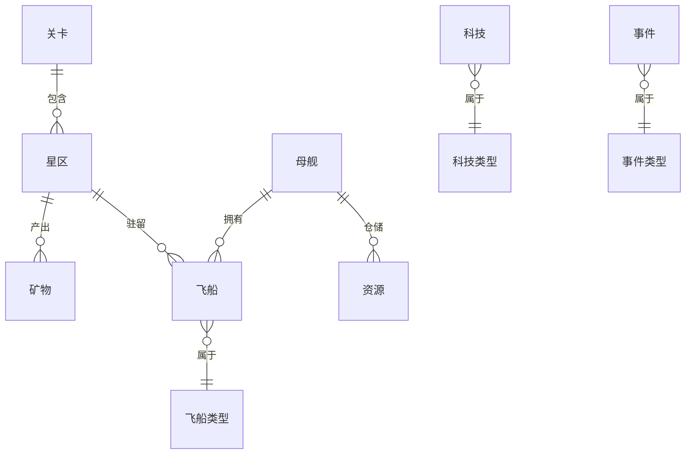

## 1. 架构设计

```mermaid
flowchart TB
    subgraph "前端层"
        "Vue 3 应用" --> "路由 (Vue Router)"
        "Vue 3 应用" --> "Pinia 状态管理"
        "Vue 3 应用" --> "Canvas 渲染循环"
    end

    subgraph "游戏引擎层"
        "Pinia 状态管理" --> "游戏状态 Store"
        "游戏状态 Store" --> "星图模块"
        "游戏状态 Store" --> "实体模块"
        "游戏状态 Store" --> "经济模块"
        "游戏状态 Store" --> "事件模块"
        "游戏状态 Store" --> "战斗模块"
        "游戏状态 Store" --> "科技模块"
    end

    subgraph "渲染层"
        "Canvas 渲染循环" --> "星图渲染器"
        "Canvas 渲染循环" --> "飞船渲染器"
        "Canvas 渲染循环" --> "特效渲染器"
        "Canvas 渲染循环" --> "HUD 渲染器"
    end

    subgraph "持久化层"
        "游戏状态 Store" --> "本地存储服务"
    end
```

## 2. 技术说明
- 前端：Vue 3 + TypeScript + Vite
- 渲染：Canvas 2D API（原生，无需 PixiJS 依赖，降低复杂度）
- 状态管理：Pinia
- 路由：Vue Router 4
- 样式：Tailwind CSS
- 持久化：localStorage（JSON 序列化）
- 初始化工具：vite-init (vue-ts 模板)

## 3. 路由定义
| 路由 | 用途 |
|------|------|
| / | 主页/关卡选择 |
| /game/:levelId | 游戏主界面（含 Canvas 渲染） |
| /result/:levelId | 关卡结算界面 |

## 4. 数据模型

### 4.1 数据模型定义



### 4.2 核心类型定义

```typescript
// 资源类型
enum ResourceType { Iron, Crystal, Deuterium, DarkMatter }

// 飞船类型
enum ShipType { Mothership, MiningShip, TransportShip, DefenseShip }

// 飞船状态
enum ShipState { Idle, Moving, Mining, Transporting, Fighting }

// 事件类型
enum EventType { Asteroid, EnergyCrisis, HostileRaid }

// 科技类型
enum TechType { MiningEfficiency, TransportCapacity, DefensePower, EnergyEfficiency }
```

### 4.3 关卡数据

**关卡一：先驱者之路**
- 星区数量：4（1母舰+3矿点）
- 初始舰队：1母舰、2采矿船、1运输船、1防卫舰
- 目标：采集 Iron 200、Crystal 100
- 事件频率：低

**关卡二：星域争夺**
- 星区数量：6（1母舰+4矿点+1敌对区）
- 初始舰队：1母舰、3采矿船、2运输船、2防卫舰
- 目标：采集 Iron 300、Crystal 200、Deuterium 100
- 事件频率：中，包含敌对袭扰

## 5. 模块架构

```
src/
├── game/                    # 游戏核心逻辑（纯 TypeScript，无 Vue 依赖）
│   ├── map/                 # 星图生成
│   │   ├── StarMapGenerator.ts
│   │   └── types.ts
│   ├── entities/            # 实体定义
│   │   ├── Ship.ts
│   │   ├── Mothership.ts
│   │   ├── Sector.ts
│   │   └── types.ts
│   ├── economy/             # 经济规则
│   │   ├── ResourceProduction.ts
│   │   ├── WarehouseCapacity.ts
│   │   └── EnergyConsumption.ts
│   ├── events/              # 事件系统
│   │   ├── EventManager.ts
│   │   ├── AsteroidEvent.ts
│   │   ├── EnergyCrisisEvent.ts
│   │   └── HostileRaidEvent.ts
│   ├── combat/              # 战斗结算
│   │   └── CombatResolver.ts
│   ├── tech/                # 科技升级
│   │   └── TechTree.ts
│   ├── levels/              # 关卡定义与目标
│   │   ├── LevelManager.ts
│   │   └── levelData.ts
│   └── core/                # 游戏循环核心
│       ├── GameLoop.ts
│       └── GameState.ts
├── renderer/                # Canvas 渲染模块
│   ├── GameRenderer.ts
│   ├── StarMapRenderer.ts
│   ├── ShipRenderer.ts
│   ├── EffectRenderer.ts
│   └── HUDRenderer.ts
├── stores/                  # Pinia 状态管理
│   ├── gameStore.ts
│   └── uiStore.ts
├── services/                # 服务层
│   └── StorageService.ts    # 本地存储
├── composables/             # Vue 组合式函数
│   ├── useGameLoop.ts
│   ├── useCanvas.ts
│   └── useSaveLoad.ts
├── components/              # Vue 组件
│   ├── StarMapCanvas.vue
│   ├── FleetPanel.vue
│   ├── ResourcePanel.vue
│   ├── ActionBar.vue
│   ├── EventModal.vue
│   ├── TechPanel.vue
│   ├── PauseOverlay.vue
│   ├── LevelSelect.vue
│   └── ResultScreen.vue
├── pages/                   # 页面组件
│   ├── HomePage.vue
│   ├── GamePage.vue
│   └── ResultPage.vue
├── types/                   # 全局类型
│   └── index.ts
├── App.vue
└── main.ts
```

## 6. 游戏循环设计

游戏采用 requestAnimationFrame 驱动的主循环：
1. **输入处理**：解析用户点击/拖拽操作
2. **逻辑更新**（按固定时间步长 dt）：
   - 飞船移动插值
   - 采矿进度计算
   - 运输到达检测
   - 能源消耗扣减
   - 事件触发判定
   - 战斗结算
   - 目标达成检测
3. **渲染**：
   - 清空画布
   - 绘制星图背景与星区节点
   - 绘制飞船与航线
   - 绘制特效
   - 绘制 HUD 叠加层

## 7. 存档机制

- 使用 localStorage 存储完整游戏状态快照
- 存档键格式：`space-mining-save-{levelId}`
- 存档内容：序列化 GameState（含星图、飞船、资源、科技、时间戳）
- 自动存档：每 30 秒自动保存
- 手动存档：玩家点击存档按钮
- 读档：关卡选择界面检测存档，提供继续选项

## 8. 性能考量

- Canvas 渲染与 Vue 响应式系统解耦：游戏逻辑通过 Pinia store 更新，渲染循环直接读取 store 状态绘制
- 飞船移动使用插值而非逐帧计算，保证平滑
- 事件判定使用概率采样而非每帧检测
- 星区节点使用离屏 Canvas 缓存，避免每帧重绘静态元素
