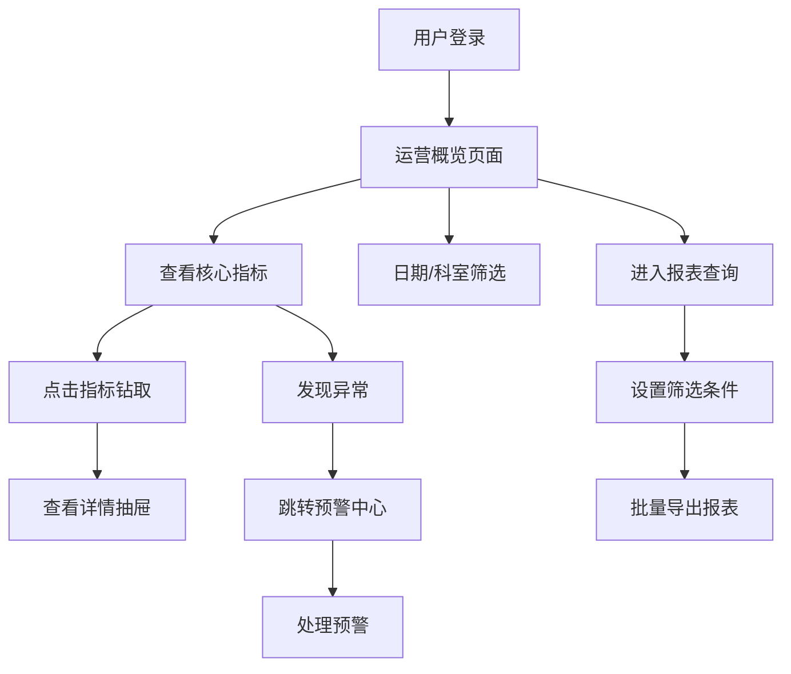

## 1. 产品概述

医院管理层运营指标前端系统，为医院管理者提供实时、直观的运营数据可视化平台，辅助决策分析。通过整合门诊、住院、床位、收入等多维度数据，帮助管理层快速掌握医院运营状况，及时发现异常并做出响应。

## 2. 核心功能

### 2.1 用户角色

| 角色 | 登录方式 | 核心权限 |
|------|----------|----------|
| 医院管理员 | 账号密码登录 | 查看所有指标、配置权限、导出报表、管理预警 |
| 科室主任 | 账号密码登录 | 查看本科室数据、导出本科室报表 |
| 院级领导 | 账号密码登录 | 查看全院汇总数据、查看预警信息 |

### 2.2 功能模块

1. **运营概览**：核心指标卡片、趋势图表、异常预警、快捷入口
2. **科室分析**：科室收入对比、门诊/住院量分析、科室绩效排名
3. **医生绩效**：医生工作量统计、收入贡献、患者满意度
4. **床位看板**：床位使用率、床位周转、床位状态实时展示
5. **费用结构**：收入构成分析、药占比趋势、医保/自费比例
6. **预约趋势**：门诊/检查预约趋势、预约转化率、候诊时间分析
7. **预警中心**：异常指标预警、预警等级、预警处理记录
8. **报表查询**：自定义报表、多条件筛选、批量导出

### 2.3 页面详情

| 页面名称 | 模块名称 | 功能描述 |
|---------|----------|---------|
| 运营概览 | 指标卡片 | 展示8大核心指标（门诊量、住院人数、床位使用率、科室收入、药占比、平均候诊时间、检查预约量、异常预警），支持环比同比 |
| 运营概览 | 趋势图表 | 多维度趋势折线图、柱状图，支持日期筛选 |
| 运营概览 | 异常预警 | 展示最新预警信息，支持快速跳转处理 |
| 科室分析 | 科室对比 | 多科室核心指标横向对比图表 |
| 科室分析 | 绩效排名 | 科室绩效排行榜，支持钻取查看详情 |
| 医生绩效 | 工作量统计 | 医生门诊量、手术量、出院人数统计 |
| 医生绩效 | 收入分析 | 医生收入构成、费用控制情况 |
| 床位看板 | 床位状态 | 实时床位占用情况，按科室分布展示 |
| 床位看板 | 使用率分析 | 床位使用率、周转天数趋势 |
| 费用结构 | 收入构成 | 药品、检查、治疗、手术等收入占比 |
| 费用结构 | 药占比趋势 | 药占比月度趋势、科室对比 |
| 预约趋势 | 预约分析 | 门诊/检查预约量趋势、预约转化率 |
| 预约趋势 | 候诊分析 | 平均候诊时间、科室候诊对比 |
| 预警中心 | 预警列表 | 分级预警列表，支持筛选和处理 |
| 预警中心 | 预警详情 | 预警原因分析、历史趋势、处理建议 |
| 报表查询 | 自定义报表 | 多条件组合筛选、字段选择 |
| 报表查询 | 批量导出 | 支持Excel、PDF格式批量导出 |

## 3. 核心流程

用户登录系统后，首先进入运营概览页面查看全院核心指标。可以通过顶部筛选栏切换日期范围和科室，查看不同维度的数据。点击指标或图表支持钻取查看详情。发现异常指标可跳转至预警中心处理。需要报表时可进入报表查询页面，自定义筛选条件后批量导出。

## 4. 用户界面设计

### 4.1 设计风格

- **主色调**：医疗蓝 `#1E88E5`，代表专业、信任、科技感
- **辅助色**：成功绿 `#4CAF50`、警告橙 `#FF9800`、危险红 `#F44336`、信息紫 `#9C27B0`
- **中性色**：深灰 `#333333`、中灰 `#666666`、浅灰 `#999999`、背景灰 `#F5F7FA`
- **按钮风格**：圆角4px，扁平化设计，hover状态有轻微阴影和颜色加深
- **字体**：主字体使用 `PingFang SC`、`Microsoft YaHei`，标题加粗，正文清晰易读
- **布局风格**：卡片式布局，顶部导航+左侧菜单+主内容区，信息层级分明
- **图标风格**：使用Element Plus内置图标，统一线性风格

### 4.2 页面设计概述

| 页面名称 | 模块名称 | UI元素 |
|---------|----------|--------|
| 运营概览 | 指标卡片 | 渐变背景卡片，数字放大展示，环比箭头，hover动效 |
| 运营概览 | 图表区域 | ECharts图表，支持图例切换、数据缩放、钻取交互 |
| 运营概览 | 预警列表 | 分级标签，时间轴展示，处理状态标识 |
| 科室分析 | 对比图表 | 分组柱状图，支持hover显示详情，点击钻取 |
| 床位看板 | 床位状态 | 网格布局，不同颜色区分状态，hover显示床位信息 |
| 预警中心 | 预警卡片 | 分级背景色，预警图标，处理按钮 |
| 报表查询 | 筛选区域 | 折叠式筛选面板，多条件组合 |
| 报表查询 | 表格区域 | 斑马纹表格，固定表头，支持多选和批量操作 |

### 4.3 响应式

采用桌面优先设计，最小支持1366px分辨率。主内容区域自适应宽度，侧边栏支持折叠。表格区域支持横向滚动。不做移动端适配，主要面向桌面端管理后台场景。

### 4.4 主题切换

支持明暗两套主题：
- **亮色主题**：白色背景，蓝色主色调，适用于日常办公
- **暗色主题**：深色背景，蓝色主色调适配，适用于夜间或长时间使用
- 主题切换按钮位于顶部导航栏右侧，切换状态本地持久化存储
