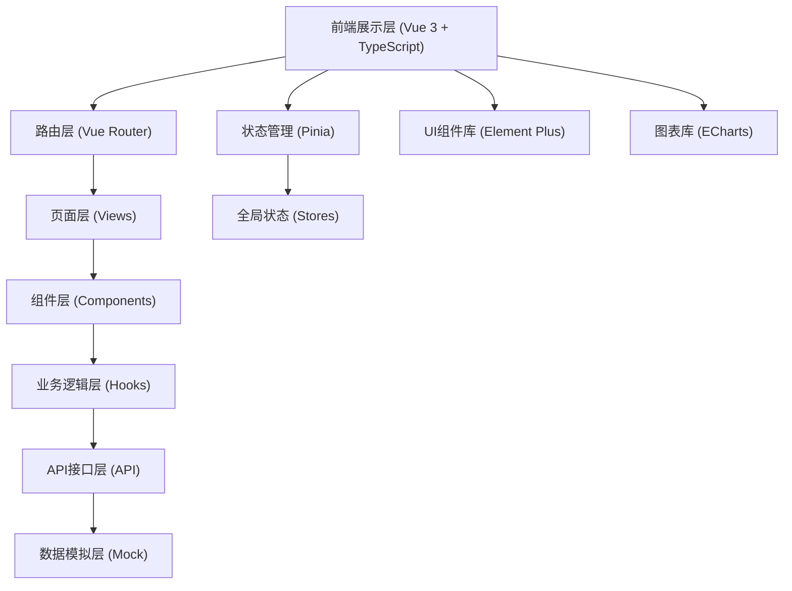

## 1. 架构设计



## 2. 技术描述

- **前端框架**：Vue 3.4+ + TypeScript 5.3+，使用 Composition API
- **构建工具**：Vite 5.0+，支持热更新、按需编译
- **路由管理**：Vue Router 4.2+，支持路由守卫、懒加载
- **状态管理**：Pinia 2.1+，模块化Store，支持持久化
- **UI组件库**：Element Plus 2.4+，按需引入，主题定制
- **图表库**：ECharts 5.4+，支持多种图表类型、数据钻取
- **HTTP请求**：Axios 1.6+，请求拦截、响应拦截、错误处理
- **Mock方案**：Vite Plugin Mock 0.5+，本地数据模拟
- **代码规范**：ESLint + Prettier，统一代码风格
- **导出功能**：xlsx + jspdf + html2canvas，支持多格式导出

## 3. 目录结构

```
src/
├── api/              # API接口层
│   ├── request.ts    # Axios封装
│   ├── overview.ts   # 运营概览接口
│   ├── department.ts # 科室分析接口
│   ├── doctor.ts     # 医生绩效接口
│   ├── bed.ts        # 床位看板接口
│   ├── cost.ts       # 费用结构接口
│   ├── appointment.ts# 预约趋势接口
│   ├── alert.ts      # 预警中心接口
│   └── report.ts     # 报表查询接口
├── mock/             # Mock数据层
│   ├── index.ts      # Mock入口
│   ├── overview.ts   # 概览Mock数据
│   ├── department.ts # 科室Mock数据
│   ├── doctor.ts     # 医生Mock数据
│   ├── bed.ts        # 床位Mock数据
│   ├── cost.ts       # 费用Mock数据
│   ├── appointment.ts# 预约Mock数据
│   ├── alert.ts      # 预警Mock数据
│   └── report.ts     # 报表Mock数据
├── stores/           # Pinia状态管理
│   ├── index.ts      # Store入口
│   ├── user.ts       # 用户信息
│   ├── menu.ts       # 菜单状态
│   ├── filter.ts     # 筛选条件
│   └── theme.ts      # 主题状态
├── router/           # 路由配置
│   ├── index.ts      # 路由入口
│   └── guards.ts     # 路由守卫
├── hooks/            # 自定义Hooks
│   ├── usePermission.ts  # 权限控制
│   ├── useExport.ts      # 导出功能
│   ├── useChart.ts       # 图表封装
│   └── useDate.ts        # 日期处理
├── views/            # 页面层
│   ├── layout/       # 布局组件
│   ├── overview/     # 运营概览
│   ├── department/   # 科室分析
│   ├── doctor/       # 医生绩效
│   ├── bed/          # 床位看板
│   ├── cost/         # 费用结构
│   ├── appointment/  # 预约趋势
│   ├── alert/        # 预警中心
│   └── report/       # 报表查询
├── components/       # 通用组件
│   ├── charts/       # 图表组件
│   ├── common/       # 公共组件
│   └── business/     # 业务组件
├── types/            # TypeScript类型定义
├── utils/            # 工具函数
├── styles/           # 全局样式
├── App.vue
└── main.ts
```

## 4. 路由定义

| 路由路径 | 页面名称 | 说明 |
|---------|----------|------|
| /login | 登录页 | 用户登录入口 |
| / | 运营概览 | 首页，展示核心指标 |
| /department | 科室分析 | 科室维度数据分析 |
| /doctor | 医生绩效 | 医生绩效统计分析 |
| /bed | 床位看板 | 床位状态实时监控 |
| /cost | 费用结构 | 收入构成分析 |
| /appointment | 预约趋势 | 预约数据趋势分析 |
| /alert | 预警中心 | 异常预警管理 |
| /report | 报表查询 | 自定义报表查询导出 |

## 5. Mock场景定义

### 5.1 场景列表

| 场景名称 | 触发条件 | 数据特征 |
|---------|----------|----------|
| 正常运营 | 默认场景 | 各项指标在正常范围内波动 |
| 科室异常 | 筛选特定异常科室 | 门诊量下降30%+，收入下降20%+ |
| 床位紧张 | 筛选外科/ICU | 床位使用率>95%，加床数>0 |
| 收入下降 | 选择上月数据 | 整体收入环比下降15%+ |
| 接口失败 | 随机触发(10%概率) | 返回500/404错误，展示错误提示 |

### 5.2 核心数据结构

```typescript
// 核心指标
interface CoreMetrics {
  outpatientVolume: number;      // 门诊量
  inpatientCount: number;        // 住院人数
  bedOccupancyRate: number;      // 床位使用率
  departmentIncome: number;      // 科室收入
  drugRatio: number;             // 药占比
  avgWaitingTime: number;        // 平均候诊时间
  examAppointments: number;      // 检查预约量
  alertCount: number;            // 异常预警数
}

// 科室数据
interface DepartmentData {
  id: string;
  name: string;
  outpatientVolume: number;
  inpatientCount: number;
  income: number;
  bedOccupancyRate: number;
  drugRatio: number;
}

// 预警数据
interface AlertData {
  id: string;
  level: 'high' | 'medium' | 'low';
  type: string;
  department: string;
  description: string;
  value: number;
  threshold: number;
  time: string;
  status: 'pending' | 'processing' | 'resolved';
}

// 床位数据
interface BedData {
  id: string;
  ward: string;
  bedNo: string;
  status: 'empty' | 'occupied' | 'reserved' | 'cleaning';
  patientName?: string;
  department: string;
  admissionDate?: string;
}
```

## 6. 核心功能实现方案

### 6.1 动态菜单与按钮权限

- 菜单配置由后端返回，前端根据用户角色动态渲染
- 按钮权限通过自定义指令 `v-permission` 控制
- 权限数据存储在Pinia的user store中

### 6.2 日期与科室联动筛选

- 全局筛选组件，支持日期范围、快捷日期、科室选择
- 筛选条件存储在Pinia的filter store中
- 使用Vue的watchEffect自动联动刷新各页面数据

### 6.3 图表钻取

- 封装通用ECharts组件，暴露click事件
- 点击图表数据点时，展示详情抽屉
- 支持多级钻取：全院→科室→医生

### 6.4 表格批量导出

- 封装useExport hook，支持Excel、PDF格式
- 支持选中行导出和全部导出
- 导出时显示loading进度

### 6.5 详情抽屉

- 通用Drawer组件，支持从右侧滑入
- 支持动态加载内容，展示详情数据
- 支持嵌套抽屉，多层级查看

### 6.6 主题切换

- 使用CSS变量定义主题色
- 主题状态存储在Pinia的theme store中
- 支持本地存储持久化，刷新后保持主题

### 6.7 空数据提示

- 通用Empty组件，支持自定义图标和文案
- 全局配置空数据默认展示
- 区分加载中、无数据、加载错误三种状态
