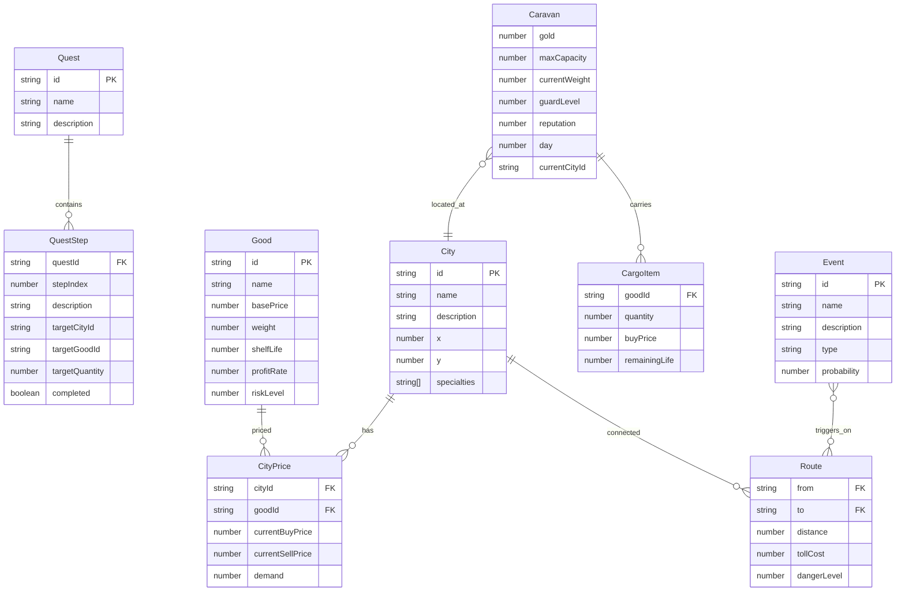

## 1. 架构设计

```mermaid
graph TB
    subgraph "前端渲染层"
        "Vue 3 App" --> "UI 面板组件"
        "Vue 3 App" --> "PixiJS Canvas 渲染"
    end
    subgraph "游戏逻辑层"
        "游戏主循环" --> "地图模块"
        "游戏主循环" --> "经济系统"
        "游戏主循环" --> "事件系统"
        "游戏主循环" --> "商队状态"
        "游戏主循环" --> "任务系统"
    end
    subgraph "数据持久层"
        "存档服务" --> "localStorage"
    end
    "UI 面板组件" --> "游戏逻辑层"
    "PixiJS Canvas 渲染" --> "地图模块"
    "游戏主循环" --> "存档服务"
```

## 2. 技术说明

- 前端：Vue 3 + TypeScript + TailwindCSS + Vite
- 渲染引擎：PixiJS v7（2D Canvas 加速渲染）
- 初始化工具：vite-init (vue-ts 模板)
- 后端：无（纯浏览器端单机游戏）
- 数据库：localStorage（本地存档）
- 状态管理：Pinia

## 3. 路由定义

| 路由 | 用途 |
|------|------|
| `/` | 游戏主界面（地图 + HUD + 面板叠加） |
| `/title` | 标题画面（新游戏 / 继续游戏） |

## 4. API 定义

无后端 API，所有数据在浏览器端计算。

## 5. 服务器架构图

不适用——纯前端项目。

## 6. 数据模型

### 6.1 数据模型定义



### 6.2 数据定义语言

所有数据以 TypeScript 接口定义于 `src/game/types.ts`，运行时以 Pinia Store 管理，存档序列化为 JSON 存入 localStorage。无需 SQL DDL。

### 6.3 代码模块拆分

| 目录 | 职责 |
|------|------|
| `src/game/map/` | 地图数据、城市定义、路线图、寻路 |
| `src/game/economy/` | 动态价格引擎、供需模型、通胀/通缩 |
| `src/game/events/` | 随机事件池、事件触发器、事件效果结算 |
| `src/game/caravan/` | 商队状态、库存管理、护卫升级 |
| `src/game/quests/` | 任务配置、任务线进度、奖励发放 |
| `src/game/render/` | PixiJS 场景、城市节点渲染、商队动画、粒子特效 |
| `src/game/save/` | 存档序列化、localStorage 读写、版本兼容 |
| `src/components/` | Vue UI 面板组件（交易、库存、任务、事件、HUD） |
| `src/composables/` | Vue 组合式函数（useGame, useCaravan, useTrade 等） |
