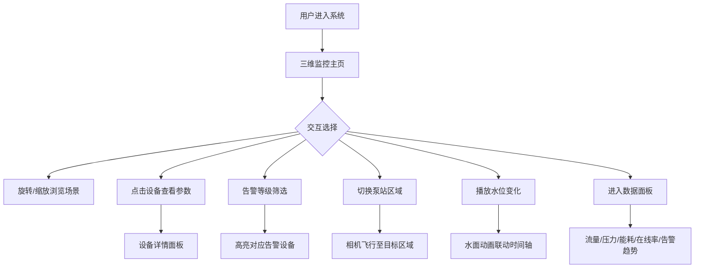

## 1. 产品概述

智慧水务泵站三维运行监控系统，面向水务运维人员，提供泵站设备的三维可视化监控与实时数据分析能力，解决传统 SCADA 界面信息密度低、空间感知弱的痛点，实现设备状态一目了然、告警秒级定位、运行趋势可回溯。

## 2. 核心功能

### 2.1 用户角色

| 角色 | 权限说明 |
|------|----------|
| 运维人员 | 查看三维场景、设备参数、告警信息、数据面板 |
| 管理人员 | 额外可查看能耗趋势与设备在线率统计 |

### 2.2 功能模块

1. **三维监控主页面**：三维泵站场景、设备交互、告警筛选、区域切换、水位播放
2. **数据面板页面**：流量、压力、能耗、在线率、告警趋势图表

### 2.3 页面详情

| 页面名称 | 模块名称 | 功能描述 |
|----------|----------|----------|
| 三维监控主页面 | 三维场景 | 展示泵房建筑、管道网络、水池、水泵、电控柜、阀门、传感器点位；支持旋转/缩放/平移 |
| 三维监控主页面 | 设备状态可视化 | 运行(绿)、停机(灰)、告警(红闪烁)、检修(黄)、离线(暗灰)五种状态颜色与动画 |
| 三维监控主页面 | 设备标签 | 悬浮标签显示设备名称、实时参数；告警设备叠加告警图标 |
| 三维监控主页面 | 设备交互 | 点击设备弹出详情面板：实时参数、运行时长、告警记录 |
| 三维监控主页面 | 告警筛选 | 按告警等级(紧急/重要/一般/提示)筛选高亮设备 |
| 三维监控主页面 | 区域切换 | 切换泵站区域(进水区/泵房区/出水区)，相机平滑飞行 |
| 三维监控主页面 | 水位变化播放 | 时间轴控制播放水池水位变化过程，水面动画联动 |
| 数据面板页面 | 流量监测 | 进/出水流量实时折线图与瞬时值 |
| 数据面板页面 | 压力监测 | 各测压点压力仪表盘 |
| 数据面板页面 | 能耗分析 | 日/月能耗柱状图与同比环比 |
| 数据面板页面 | 设备在线率 | 设备在线率环形图 |
| 数据面板页面 | 告警趋势 | 告警数量趋势折线图与等级分布 |

## 3. 核心流程

用户打开系统后进入三维监控主页，可自由旋转缩放浏览整个泵站三维场景。发现告警设备（红色闪烁）后点击查看详情，或通过顶部告警筛选按等级过滤。切换区域标签可快速聚焦进水区、泵房区或出水区。点击水位播放按钮后，时间轴自动推进，水池水面随水位数据变化。需要查看数据趋势时，点击数据面板入口切换至图表视图。

## 4. 用户界面设计

### 4.1 设计风格

- 主色调：深蓝科技风(#0a1628 背景，#1e90ff 主强调色，#00e5ff 辅助强调色)
- 告警色：紧急红(#ff4d4f)、重要橙(#faad14)、一般蓝(#1890ff)、提示灰(#8c8c8c)
- 状态色：运行绿(#52c41a)、停机灰(#595959)、检修黄(#fadb14)
- 按钮：圆角6px、微发光边框、hover亮度提升
- 字体：标题用 DIN Alternate 数据风字体，正文用微软雅黑/PingFang SC
- 布局：左侧三维场景为主(70%)，右侧信息面板(30%)，顶部工具栏

### 4.2 页面设计概览

| 页面名称 | 模块名称 | UI 元素 |
|----------|----------|---------|
| 三维监控主页面 | 三维场景 | 深色背景、雾化效果、环境光+方向光、设备发光材质 |
| 三维监控主页面 | 设备标签 | 半透明深色底+亮色文字、告警图标脉冲动画 |
| 三维监控主页面 | 告警筛选栏 | 顶部横排按钮组、等级色圆点标识、选中态高亮 |
| 三维监控主页面 | 区域切换 | 顶部Tab标签页、选中态下划线动画 |
| 三维监控主页面 | 水位播放器 | 底部时间轴滑块+播放/暂停按钮+速度选择 |
| 三维监控主页面 | 设备详情面板 | 右侧滑出面板、参数卡片+迷你趋势图+告警列表 |
| 数据面板页面 | 图表区域 | 2x2网格布局、深色卡片容器、ECharts暗色主题 |

### 4.3 响应式设计

- 桌面优先(1920x1080基准)
- 三维场景自适应容器尺寸，信息面板可折叠
- 图表区域在窄屏下纵向堆叠

### 4.4 三维场景指引

- 环境：深蓝夜空HDRI氛围，底部网格地面，环境雾增加空间感
- 灯光：环境光(0x1a2a4a, 0.4) + 方向光(0xffffff, 0.8) + 点光源(设备运行指示灯)
- 相机：透视相机(FOV 50)，初始俯视45度角，OrbitControls 限制最大仰角
- 构图：泵站居中，管道向外延伸，水池在左前方，电控柜在右后方
- 交互：OrbitControls旋转/缩放/平移，Raycaster点击拾取，Tween相机飞行动画
- 动画：水泵叶轮旋转、管道内粒子流动、水面波动、告警设备脉冲发光
- 后处理：设备发光使用自发光材质而非后处理，保证性能
- 性能预算：60fps@1080p，设备数<100，Draw Call<200
