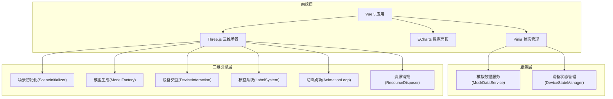

## 1. 架构设计



## 2. 技术说明

- 前端框架：Vue 3.4 + TypeScript 5.x + Vite 5.x
- UI 样式：Tailwind CSS 3.x
- 三维引擎：Three.js 0.160+
- 图表库：ECharts 5.x + vue-echarts
- 状态管理：Pinia
- 路由：Vue Router 4.x
- 初始化工具：vite-init (vue-ts 模板)
- 后端：无，纯前端 + 模拟数据
- 数据库：无，使用内存模拟数据

## 3. 路由定义

| 路由 | 用途 |
|------|------|
| / | 三维监控主页面 |
| /dashboard | 数据面板页面 |

## 4. API 定义

本项目无后端，使用模拟数据服务。核心数据接口定义：

```typescript
interface DeviceData {
  id: string
  name: string
  type: 'pump' | 'valve' | 'sensor' | 'cabinet' | 'pool' | 'pipe'
  status: 'running' | 'stopped' | 'alarm' | 'maintenance' | 'offline'
  position: { x: number; y: number; z: number }
  params: Record<string, number | string>
  alarms: AlarmInfo[]
  area: 'intake' | 'pumpHouse' | 'outlet'
}

interface AlarmInfo {
  id: string
  level: 'critical' | 'major' | 'minor' | 'info'
  message: string
  timestamp: number
  deviceId: string
}

interface TimeSeriesPoint {
  time: number
  value: number
}

interface StationMetrics {
  flowIn: TimeSeriesPoint[]
  flowOut: TimeSeriesPoint[]
  pressure: Record<string, TimeSeriesPoint[]>
  energyDaily: TimeSeriesPoint[]
  energyMonthly: TimeSeriesPoint[]
  onlineRate: { online: number; offline: number }
  alarmTrend: TimeSeriesPoint[]
  alarmDistribution: Record<string, number>
}

interface WaterLevelData {
  timestamps: number[]
  levels: number[]
}
```

## 5. 目录结构

```
src/
├── components/
│   ├── three/               # 三维相关组件
│   │   ├── SceneContainer.vue    # 三维场景容器
│   │   ├── DeviceDetailPanel.vue # 设备详情面板
│   │   └── WaterLevelPlayer.vue  # 水位变化播放器
│   ├── ui/                  # UI 组件
│   │   ├── AlarmFilter.vue       # 告警筛选
│   │   ├── AreaSwitch.vue        # 区域切换
│   │   ├── TopToolbar.vue        # 顶部工具栏
│   │   └── StatusBar.vue         # 底部状态栏
│   └── charts/              # ECharts 图表组件
│       ├── FlowChart.vue         # 流量图
│       ├── PressureGauge.vue     # 压力仪表
│       ├── EnergyChart.vue       # 能耗图
│       ├── OnlineRateChart.vue   # 在线率图
│       └── AlarmTrendChart.vue   # 告警趋势图
├── composables/             # 组合式函数
│   ├── useThreeScene.ts         # 三维场景初始化/销毁
│   ├── useModelFactory.ts       # 模型生成
│   ├── useDeviceInteraction.ts  # 设备交互(Raycaster)
│   ├── useLabelSystem.ts        # 标签系统(CSS2DRenderer)
│   ├── useAnimationLoop.ts      # 动画刷新循环
│   └── useCameraAnimation.ts    # 相机飞行动画
├── services/                # 服务
│   └── mockDataService.ts       # 模拟数据服务
├── stores/                  # Pinia 状态
│   ├── deviceStore.ts           # 设备状态
│   ├── alarmStore.ts            # 告警状态
│   └── sceneStore.ts            # 场景状态
├── pages/                   # 页面
│   ├── MonitorPage.vue          # 三维监控主页
│   └── DashboardPage.vue        # 数据面板页
├── types/                   # 类型定义
│   └── index.ts
├── utils/                   # 工具函数
│   └── resourceDisposer.ts      # 资源销毁
├── App.vue
└── main.ts
```

## 6. 核心模块说明

### 6.1 场景初始化 (useThreeScene)
- 创建 Scene、Camera、Renderer、OrbitControls
- 配置灯光(环境光+方向光+辅助点光源)
- 配置雾化效果与地面网格
- CSS2DRenderer 叠加用于设备标签
- 监听窗口 resize 自适应

### 6.2 模型生成 (useModelFactory)
- 泵房：BoxGeometry 组合建筑外壳 + 半透明墙体
- 管道：CylinderGeometry/TubeGeometry 连接设备
- 水池：BoxGeometry 容器 + 动态水面 PlaneGeometry
- 水泵：CylinderGeometry 主体 + 旋转叶轮
- 电控柜：BoxGeometry 柜体 + 指示灯 SphereGeometry
- 阀门：TorusGeometry 阀体 + 手轮 CylinderGeometry
- 传感器：SphereGeometry + 连接柄 CylinderGeometry
- 每个设备模型携带 userData 存储设备ID与类型

### 6.3 设备交互 (useDeviceInteraction)
- Raycaster 拾取点击设备
- hover 高亮轮廓(修改 emissive)
- 点击弹出设备详情面板

### 6.4 标签系统 (useLabelSystem)
- CSS2DObject 绑定到设备位置
- 显示设备名称、关键参数
- 告警设备叠加脉冲告警图标

### 6.5 动画刷新 (useAnimationLoop)
- requestAnimationFrame 主循环
- 水泵叶轮旋转
- 管道粒子流动(Points + ShaderMaterial)
- 水面波动(sin波)
- 告警设备脉冲发光(emissive 闪烁)
- 水位变化时水面高度联动

### 6.6 模拟数据服务 (mockDataService)
- 生成设备列表(含参数与状态)
- 生成告警数据(随机等级与设备关联)
- 生成时序数据(流量/压力/能耗/在线率/告警趋势)
- 生成水位变化数据
- 定时推送数据更新(模拟实时)

### 6.7 资源销毁 (resourceDisposer)
- 遍历场景 Object3D 递归 dispose
- 清理 Geometry、Material、Texture
- 移除事件监听(resize、click、mousemove)
- 释放 Renderer、Controls
- 清空 CSS2DObject DOM
