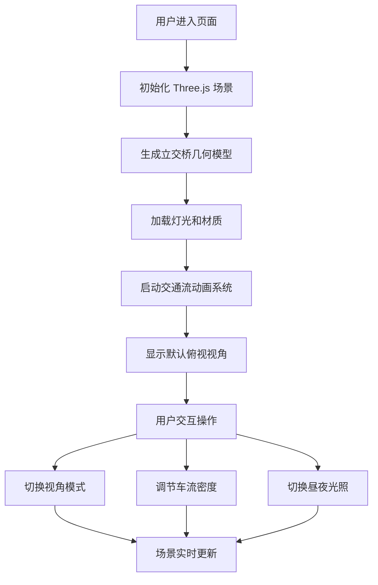

## 1. 产品概述

城市立交桥三维可视化展示系统，使用交互式 3D 技术呈现复杂的城市立交桥结构与交通流动态。面向交通规划者、工程学习者和城市管理者，提供直观的桥梁结构观察和交通流模拟体验。

- 核心目标：通过真实感 3D 渲染展示立交桥的多层结构、匝道连接、交通组织等复杂工程特征
- 目标用户：交通工程师、城市规划师、建筑院校师生、交通科普爱好者
- 产品价值：将抽象的工程图纸转化为可交互的 3D 模型，支持多视角观察和动态模拟

## 2. 核心功能

### 2.1 用户角色

| 角色 | 注册方式 | 核心权限 |
|------|----------|----------|
| 普通用户 | 无需注册 | 浏览 3D 场景、切换视角、调节控制参数 |

### 2.2 功能模块

1. **3D 场景主界面**：立交桥完整三维模型展示、实时渲染
2. **视角控制系统**：俯视视角、驾驶视角、自由视角三种模式切换
3. **交通流模拟**：多车道车辆自动行驶、路径跟随动画
4. **控制面板**：车流密度调节、昼夜光照切换、道路状态控制
5. **信息展示**：桥梁结构标签、动态数据统计

### 2.3 页面详情

| 页面名称 | 模块名称 | 功能描述 |
|-----------|-------------|---------------------|
| 主页面 | 3D 场景渲染 | Three.js 引擎驱动的完整立交桥模型，包含主路、匝道、桥墩、护栏、路灯、绿化带、周边建筑 |
| 主页面 | 视角切换器 | 三种预设视角快速切换，自由视角支持鼠标键盘控制 |
| 主页面 | 控制面板 | 滑杆调节车流密度，按钮切换昼/夜模式，道路状态切换（正常/施工/拥堵） |
| 主页面 | 信息标签 | 鼠标悬停显示桥梁构件名称和参数 |

## 3. 核心流程

用户打开页面 → 3D 场景初始化加载 → 自动开始交通流模拟 → 默认俯视视角浏览 → 用户可切换视角或调节控制面板参数 → 场景实时响应参数变化

## 4. 界面设计

### 4.1 设计风格

- 主色调：深灰蓝 (#1a2332) 作为背景，配合科技感青色 (#00d4ff) 作为交互元素高亮
- 辅色调：警示橙 (#ff9500) 用于施工状态标识，交通绿 (#34c759) 用于正常状态
- 面板风格：半透明玻璃拟态，毛玻璃效果 + 细边框，圆角 8px
- 字体：主标题使用 'Rajdhani' 科技感字体，正文使用 'Inter' 清晰易读
- 整体风格：科技感、工程感、数据可视化风格

### 4.2 页面设计概览

| 页面名称 | 模块名称 | UI 元素 |
|-----------|-------------|-------------|
| 主页面 | 3D 视口 | 全屏渲染，带细微暗角效果，左下角显示当前视角模式 |
| 主页面 | 视角切换按钮 | 右上角三个圆形按钮，带图标，悬停放大动画 |
| 主页面 | 控制面板 | 右侧可折叠抽屉式面板，带滑杆、开关和状态指示 |
| 主页面 | 信息标签 | 鼠标悬停时显示，带箭头指示，淡入淡出动画 |
| 主页面 | 统计面板 | 左下角半透明卡片，显示车辆数、平均速度等数据 |

### 4.3 响应性

- 桌面端优先设计，支持 1920×1080 及以上分辨率
- 面板可拖拽和最小化，适应不同屏幕尺寸
- 控制面板在小屏幕转为底部抽屉式布局
- 3D 画布自适应窗口大小变化

### 4.4 3D 场景指引

- **环境**：使用程序化天空盒，白天模式配 HDR 环境光，夜间模式使用深色背景配星空效果
- **光照**：白天使用方向光模拟太阳光 + 柔和环境光；夜间使用路灯点光源 + 车辆大灯 + 月光
- **相机**：俯视视角固定高度和角度；驾驶视角绑定到特定车辆；自由视角支持 WASD 移动 + 鼠标拖拽旋转
- **构图**：立交桥位于场景中心，周边建筑作为背景衬托，留出足够空间观察各个角度
- **动画**：车辆平滑沿路径行驶，车轮同步旋转，转向灯闪烁；路灯夜间自动点亮
- **后处理**：轻微泛光效果增强夜间灯光，色彩分级增强画面质感，阴影柔和边缘
- **性能**：使用实例化渲染处理大量车辆，LOD 优化远处建筑，帧率目标 60fps
