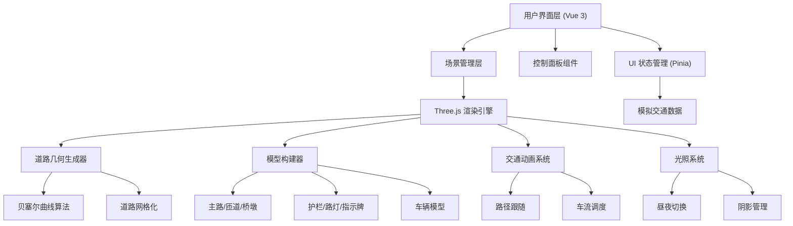

## 1. 架构设计



## 2. 技术选型

- **前端框架**：Vue 3 + `<script setup>` + TypeScript
- **构建工具**：Vite 5.x
- **3D 引擎**：Three.js 0.160.x
- **状态管理**：Pinia 2.x
- **样式方案**：Tailwind CSS 3.x
- **UI 图标**：Lucide Vue
- **类型支持**：@types/three

## 3. 目录结构

```
src/
├── components/
│   ├── ControlPanel.vue      # 控制面板
│   ├── ViewSwitcher.vue      # 视角切换器
│   ├── InfoLabel.vue         # 信息标签
│   └── StatsPanel.vue        # 统计面板
├── composables/
│   ├── useThreeScene.ts      # Three.js 场景管理
│   ├── useRoadGenerator.ts   # 道路生成
│   ├── useTrafficSystem.ts   # 交通系统
│   └── useCameraController.ts # 相机控制
├── store/
│   └── sceneStore.ts         # 场景状态管理
├── types/
│   └── index.ts              # 类型定义
├── utils/
│   ├── curveUtils.ts         # 曲线计算工具
│   ├── geometryUtils.ts      # 几何工具
│   └── materialPresets.ts    # 材质预设
├── data/
│   └── trafficData.ts        # 模拟交通数据
├── App.vue
├── main.ts
└── style.css
```

## 4. 核心模块说明

### 4.1 道路曲线生成模块

- 使用 Catmull-Rom 样条曲线生成平滑的道路中心线
- 支持多层立交桥的高度插值，实现自然的坡道过渡
- 根据曲线法线方向生成道路宽度的两侧边界
- 沿曲线等距采样生成桥面网格顶点

### 4.2 桥梁结构建模

- **主路**：多层水平主干道，带中间隔离带
- **匝道**：连接不同层级的弯曲匝道，有坡度变化
- **桥墩**：圆柱形桥墩，沿主路等距分布，支撑桥面
- **护栏**：W 型防撞护栏，使用线条或管状几何体
- **路灯**：灯杆 + 灯罩，夜间发光

### 4.3 车辆动画系统

- 预制多种车辆模型（轿车、SUV、货车）
- 沿预设路径使用 `getPointAt()` 获取位置
- 使用 `getTangentAt()` 计算朝向角度
- 车流密度控制：动态创建/销毁车辆实例
- 实例化渲染 (InstancedMesh) 优化性能

### 4.4 多视角控制

- **俯视视角**：OrthographicCamera，固定在立交桥正上方
- **驾驶视角**：PerspectiveCamera，绑定到特定车辆上方
- **自由视角**：PerspectiveCamera，支持 OrbitControls + WASD 移动

### 4.5 光照与材质

- 白天：DirectionalLight + AmbientLight，投射阴影
- 夜间：PointLight（路灯）+ SpotLight（车灯），开启发光材质
- 路面使用 MeshStandardMaterial，带法线贴图增强质感
- 玻璃幕墙建筑使用 MeshPhysicalMaterial 实现透明效果

## 5. 性能优化策略

1. **实例化渲染**：大量重复物体（车辆、路灯、护栏）使用 InstancedMesh
2. **LOD 控制**：远处建筑使用简化几何体，近处使用高细节模型
3. **视锥剔除**：Three.js 内置视锥剔除，减少不可见物体渲染
4. **阴影优化**：限制阴影贴图大小，仅关键物体投射/接收阴影
5. **帧率自适应**：根据设备性能动态调整渲染质量
6. **内存管理**：及时 dispose 不再使用的几何体和材质

## 6. 关键类型定义

```typescript
// 道路点定义
interface RoadPoint {
  x: number;
  y: number;
  z: number;
}

// 道路段定义
interface RoadSegment {
  id: string;
  name: string;
  type: 'main' | 'ramp';
  level: number;
  points: RoadPoint[];
  width: number;
  lanes: number;
}

// 车辆定义
interface Vehicle {
  id: string;
  type: 'car' | 'suv' | 'truck';
  pathId: string;
  progress: number;
  speed: number;
  color: number;
}

// 场景状态
interface SceneState {
  cameraMode: 'top' | 'driving' | 'free';
  trafficDensity: number;
  timeOfDay: 'day' | 'night';
  roadStatus: 'normal' | 'construction' | 'congested';
  showLabels: boolean;
}
```
