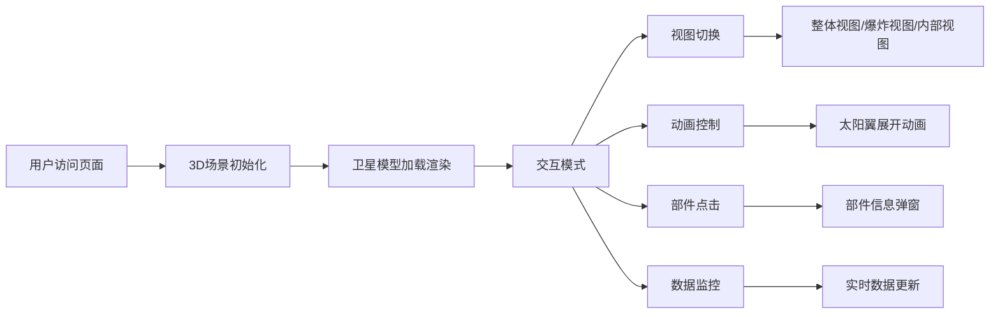

## 1. 产品概述

高还原度卫星三维结构交互式展示系统，使用 Vue 3 + TypeScript + Three.js 技术栈，实现卫星部件的精细化建模、多视图切换、动画演示和实时数据监控。

- 主要用途：航天科普展示、工程教学演示、卫星结构可视化
- 目标用户：航天爱好者、学生、工程师、科普教育机构
- 核心价值：通过沉浸式3D交互体验，直观展示卫星的复杂结构和工作原理

## 2. 核心功能

### 2.1 用户角色
| 角色 | 访问方式 | 核心权限 |
|------|----------|----------|
| 访客用户 | 浏览器直接访问 | 浏览3D模型、切换视图、播放动画、查看部件信息 |

### 2.2 功能模块
1. **3D场景主界面**：卫星模型渲染、轨道控制、环境光照
2. **视图切换系统**：整体视图、爆炸拆解视图、内部结构视图
3. **动画控制系统**：太阳翼展开/收起动画、部件旋转展示
4. **交互标签系统**：点击部件显示功能说明弹窗
5. **实时数据面板**：功率、姿态、温度、通信状态模拟数据
6. **资源管理系统**：模型缓存清理、内存优化

### 2.3 页面详情
| 页面名称 | 模块名称 | 功能描述 |
|---------|----------|----------|
| 主展示页 | 3D场景渲染 | 高细节卫星模型、可旋转缩放、环境光效 |
| 主展示页 | 视图控制栏 | 三种视图模式一键切换、视角复位 |
| 主展示页 | 动画控制栏 | 太阳翼展开动画播放/暂停/重置、速度调节 |
| 主展示页 | 部件信息弹窗 | 点击部件显示名称、功能、技术参数 |
| 主展示页 | 数据监控面板 | 实时显示模拟遥测数据、状态指示 |

## 3. 核心流程

用户进入页面 → 3D场景初始化加载卫星模型 → 鼠标拖拽旋转/滚轮缩放查看整体结构 → 切换爆炸视图观察部件连接关系 → 播放太阳翼展开动画 → 点击各部件查看详细说明 → 查看数据面板的实时状态模拟

## 4. 用户界面设计

### 4.1 设计风格
- **主色调**：深空蓝 (#0a1628)、科技蓝 (#00d4ff)、金属银 (#c0c0c0)
- **辅助色**：状态绿 (#00ff88)、警告黄 (#ffaa00)、告警红 (#ff4444)
- **按钮风格**：圆角矩形、玻璃拟态效果、悬停发光动画
- **字体**：JetBrains Mono (数字)、Noto Sans SC (中文)
- **布局风格**：暗黑科技风、半透明控制面板、HUD式数据展示
- **图标风格**：线性图标、科技感几何图形

### 4.2 页面设计概述
| 页面名称 | 模块名称 | UI元素 |
|---------|----------|--------|
| 主展示页 | 3D场景 | 全屏幕渲染、星空背景、光晕效果 |
| 主展示页 | 顶部控制栏 | 视图切换按钮组、标题、全屏按钮 |
| 主展示页 | 底部控制栏 | 动画播放控制、进度条、速度调节 |
| 主展示页 | 右侧数据面板 | 四象限数据卡片、状态指示灯、趋势图表 |
| 主展示页 | 信息弹窗 | 圆角卡片、渐变边框、部件缩略图 |

### 4.3 响应式设计
- 桌面端优先设计，适配 1920×1080 及以上分辨率
- 平板端：数据面板可折叠、控制栏自适应缩放
- 移动端：简化控制界面、优化触摸交互

### 4.4 3D场景指南
- **环境**：黑色深空背景、远处星点粒子系统、柔和环境光
- **光照设置**：主方向光模拟太阳光、环境光补光、金属高光反射
- **相机设置**：PerspectiveCamera、轨道控制器、阻尼平滑效果
- **交互方式**：左键旋转、右键平移、滚轮缩放、双击复位
- **动画效果**：太阳翼展开采用缓动曲线、爆炸视图分层位移、部件高亮发光
- **后处理**：Bloom泛光效果、轻微抗锯齿、色调映射
- **性能优化**：LOD层级细节、实例化渲染、合理的几何体面数控制
