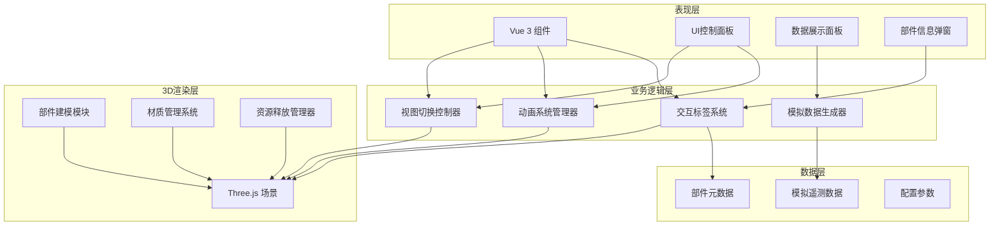

## 1. 架构设计



## 2. 技术栈说明

- **前端框架**：Vue 3.4 + TypeScript 5.3 + Vite 5.0
- **3D渲染**：Three.js 0.160 + @tweenjs/tween.js
- **样式方案**：SCSS + CSS Modules
- **状态管理**：Vue Composition API (ref/reactive)
- **构建工具**：Vite 5.0
- **代码规范**：ESLint + Prettier

## 3. 目录结构

```
src/
├── components/           # Vue 组件
│   ├── SceneViewer.vue   # 3D场景容器
│   ├── ControlBar.vue    # 顶部控制栏
│   ├── AnimationBar.vue  # 动画控制栏
│   ├── DataPanel.vue     # 数据监控面板
│   └── PartInfoModal.vue # 部件信息弹窗
├── three/                # Three.js 相关模块
│   ├── core/             # 核心场景管理
│   │   ├── SceneManager.ts
│   │   └── CameraController.ts
│   ├── models/           # 部件建模
│   │   ├── SatelliteBuilder.ts
│   │   ├── MainBody.ts
│   │   ├── SolarPanel.ts
│   │   ├── Antenna.ts
│   │   ├── Thruster.ts
│   │   ├── Sensor.ts
│   │   ├── HeatSink.ts
│   │   ├── Support.ts
│   │   ├── Cable.ts
│   │   └── InternalModule.ts
│   ├── materials/        # 材质管理
│   │   └── MaterialManager.ts
│   ├── animation/        # 动画系统
│   │   ├── AnimationSystem.ts
│   │   └── SolarPanelAnimator.ts
│   ├── interaction/      # 交互系统
│   │   ├── Raycaster.ts
│   │   └── LabelSystem.ts
│   └── utils/            # 工具函数
│       └── ResourceDisposer.ts
├── data/                 # 数据定义
│   ├── partMetadata.ts   # 部件元数据
│   └── mockTelemetry.ts  # 模拟遥测数据
├── types/                # TypeScript 类型定义
│   └── index.ts
├── App.vue
└── main.ts
```

## 4. 核心类定义

### 4.1 场景管理器
```typescript
class SceneManager {
  scene: THREE.Scene
  camera: THREE.PerspectiveCamera
  renderer: THREE.WebGLRenderer
  controls: OrbitControls
  
  init(container: HTMLElement): void
  render(): void
  dispose(): void
}
```

### 4.2 卫星构建器
```typescript
class SatelliteBuilder {
  group: THREE.Group
  parts: Map<string, THREE.Object3D>
  
  buildMainBody(): THREE.Group
  buildSolarPanels(): THREE.Group
  buildAntenna(): THREE.Group
  buildThrusters(): THREE.Group
  buildSensors(): THREE.Group
  buildHeatSinks(): THREE.Group
  buildSupports(): THREE.Group
  buildCables(): THREE.Group
  buildInternalModules(): THREE.Group
  assemble(): THREE.Group
}
```

### 4.3 动画系统
```typescript
class AnimationSystem {
  tweenGroup: TWEEN.Group
  animations: Map<string, TWEEN.Tween>
  
  playSolarPanelDeployment(onProgress?: (p: number) => void): Promise<void>
  playExplodedView(factor: number): Promise<void>
  playInternalView(): Promise<void>
  stopAll(): void
}
```

### 4.4 材质管理器
```typescript
class MaterialManager {
  materials: Map<string, THREE.Material>
  
  getMetalMaterial(): THREE.MeshStandardMaterial
  getSolarCellMaterial(): THREE.MeshStandardMaterial
  getCarbonFiberMaterial(): THREE.MeshStandardMaterial
  getGlowMaterial(color: number): THREE.MeshBasicMaterial
}
```

## 5. 部件元数据结构

```typescript
interface PartMetadata {
  id: string
  name: string
  category: 'structure' | 'power' | 'communication' | 'propulsion' | 'sensor' | 'thermal' | 'internal'
  description: string
  specifications: {
    [key: string]: string
  }
  function: string
}
```

## 6. 模拟遥测数据结构

```typescript
interface TelemetryData {
  power: {
    solarPanelOutput: number
    batteryLevel: number
    powerConsumption: number
  }
  attitude: {
    roll: number
    pitch: number
    yaw: number
    angularVelocity: { x: number; y: number; z: number }
  }
  temperature: {
    body: number
    solarPanel: number
    battery: number
    cpu: number
  }
  communication: {
    signalStrength: number
    dataRate: number
    linkStatus: 'connected' | 'disconnected' | 'degraded'
  }
  timestamp: number
}
```

## 7. 性能优化策略

1. **几何体优化**：合理控制面数，使用 BufferGeometry
2. **材质复用**：共享相同材质，减少 GPU 状态切换
3. **视锥剔除**：启用 frustumCulled
4. **LOD 技术**：根据距离显示不同细节级别
5. **内存管理**：及时 dispose 不再使用的几何体和材质
6. **渲染优化**：使用 requestAnimationFrame，合理设置像素比
